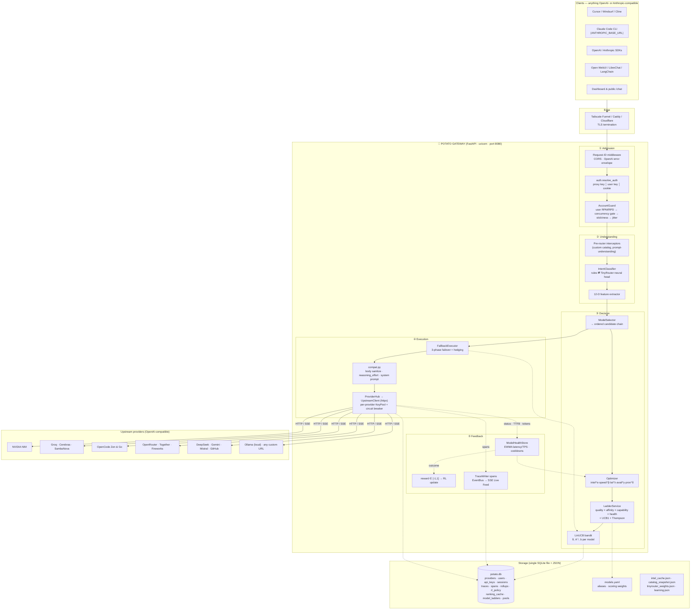
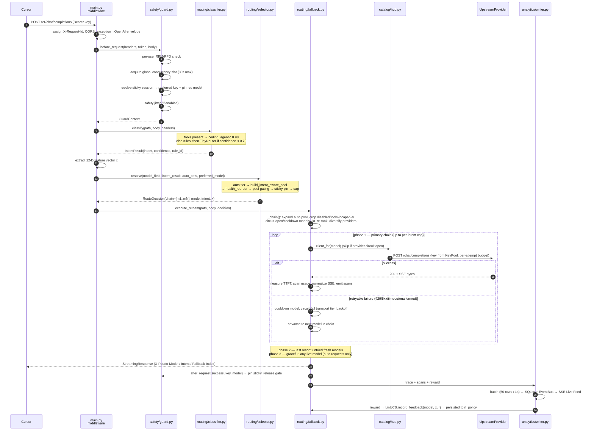
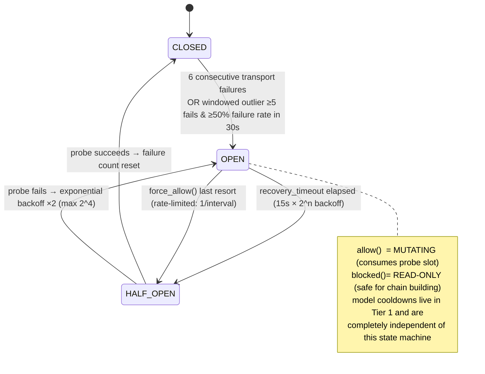
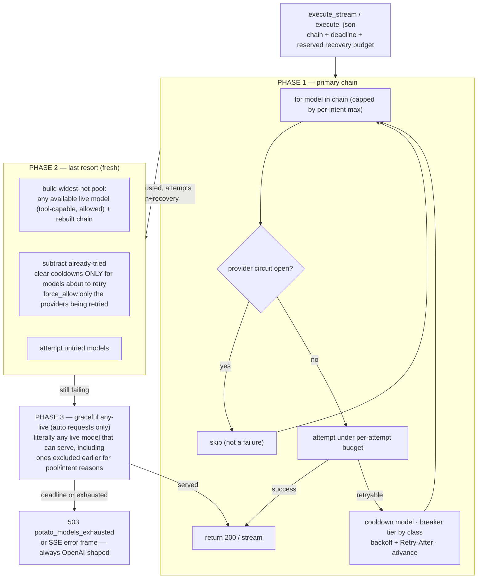
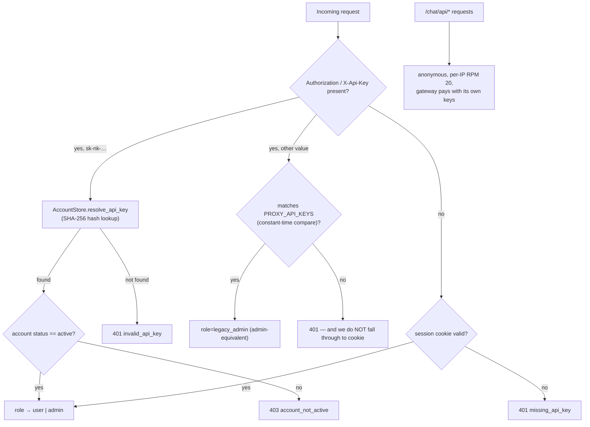
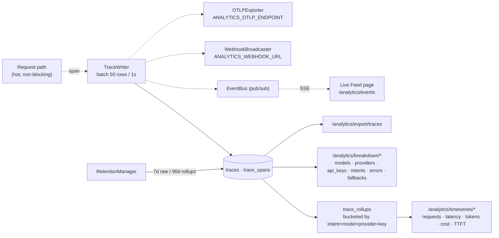

<div align="center">

# 🥔 Potato Gateway

### **The self-hosted brain that sits between your AI apps and 20+ LLM providers — and decides, for every single request, which model should answer it.**

[](https://github.com/vskrch/potato-gateway)
[](https://python.org)
[](https://fastapi.tiangolo.com)
[](https://react.dev)
[](#-testing--quality-gates)
[%20%2B%20JSON-E4B326?style=flat-square&logo=sqlite&logoColor=white)](#-storage-architecture)
[](#-routing-intelligence-why-it-exists)
[](LICENSE)

**One base URL. One API key. Every model. Automatic failover. Zero vendor lock-in.**

`http://your-gateway:8080/v1` ← point Cursor, Claude Code, Cline, OpenCode, Open WebUI,
LangChain, or any OpenAI/Anthropic SDK at this. That's the whole integration.

[**Quick Start**](#-quick-start-60-seconds) · [**How It Works**](#-end-to-end-request-lifecycle-the-heart-of-potato) · [**Architecture**](#%EF%B8%8F-system-architecture) · [**API Reference**](#-full-api-reference) · [**Deploy**](#-deployment) · [**Dashboard**](#%EF%B8%8F-the-dashboard)

---

 →
[What even is an LLM gateway?](#-what-is-potato-60-second-explainer) → [Request lifecycle](#-end-to-end-request-lifecycle-the-heart-of-potato) → [Routing](#-routing-intelligence-why-it-exists) → [Resilience](#%EF%B8%8F-resilience--reliability-why-requests-never-die)

</div>

---

## 📑 Table of Contents

- [🥔 What is Potato? (60-second explainer)](#-what-is-potato-60-second-explainer)
- [✨ Feature map](#-feature-map)
- [🗺️ Repository map](#%EF%B8%8F-repository-map-every-file-explained)
- [🏗️ System architecture](#%EF%B8%8F-system-architecture)
- [🧭 End-to-end request lifecycle](#-end-to-end-request-lifecycle-the-heart-of-potato)
- [🧠 Routing intelligence](#-routing-intelligence-why-it-exists)
  - [Intent classification](#1-intent-classification--what-are-you-asking-for)
  - [Feature extraction](#2-feature-extraction--the-12-dimensional-recipe-card)
  - [Chain building (ModelSelector)](#3-chain-building-modelselector--who-could-answer)
  - [The Ladder (offline scoring)](#4-the-ladder-offline-scoring--whos-best)
  - [The Optimizer (per-request scoring)](#5-the-optimizer-per-request-scoring--whos-best-right-now)
  - [LinUCB bandit (online learning)](#6-linucb-contextual-bandit--learning-from-every-request)
  - [Exploration & anti-celebrity](#7-exploration--anti-celebrity--never-get-stuck-on-one-model)
  - [Intent gating & admin control](#8-intent-gating--admin-control--put-models-on-leashes)
  - [Virtual model IDs](#-virtual-model-ids)
- [🛡️ Resilience & reliability](#%EF%B8%8F-resilience--reliability-why-requests-never-die)
  - [Key pool](#1-key-poolbalancer--traffic-spread-across-your-api-keys)
  - [Two-tier circuit breaker](#2-two-tier-circuit-breaker--quarantine-without-overreacting)
  - [Model health store](#3-model-health-store--short-adaptive-cooldowns)
  - [Fallback executor](#4-fallback-executor--the-three-phase-failover-engine)
  - [Deadlines & budgets](#5-deadlines--budgets--time-is-a-resource)
  - [Streaming resilience](#6-streaming-resilience--ttft--idle-watchdogs--hedging)
  - [Self-healing loop](#7-self-healing-loop--the-gateway-fixes-itself)
- [🔌 Protocol compatibility layer](#-protocol-compatibility-layer)
- [🔐 Auth & multi-tenancy](#-auth--multi-tenancy)
- [📊 Analytics & observability](#-analytics--observability)
- [🗄️ Storage architecture](#%EF%B8%8F-storage-architecture)
- [🌐 Full API reference](#-full-api-reference)
- [⚙️ Configuration reference](#%EF%B8%8F-configuration-reference)
- [🖥️ The dashboard](#%EF%B8%8F-the-dashboard)
- [🚀 Quick start / Local dev](#-quick-start)
- [📦 Deployment](#-deployment)
- [🧪 Testing & quality gates](#-testing--quality-gates)
- [🧭 Design decisions (ADRs)](#-design-decisions-adr-summary)
- [❓ Troubleshooting & FAQ](#-troubleshooting--faq)
- [🙏 Credits](#-credits--acknowledgements)

---

## 🥔 What is Potato? (60-second explainer)

**The problem.** You use AI in 5 tools (Cursor, Claude Code, Cline, a chat UI, your own app).
Each tool needs its own API key, has its own rate limits, and only talks to *one* vendor.
When OpenAI is down, your work stops. When you hit a rate limit, you wait. When a new,
better, cheaper model ships, you have to change 5 configs.

**The fix.** Potato is a small server you run yourself. Every AI tool points at *Potato*
instead of at the vendors. Potato forwards the request to whichever vendor currently makes
the most sense — and if that vendor fails, it instantly tries the next one, and the next,
and the next. Your tool never notices.

**The Analogy:**

```
      YOUR TOOLS                          POTATO                      THE VENDORS
┌───────────────────┐              ┌──────────────────┐         ┌─────────────────────┐
│ Cursor            │──┐           │                  │   ┌────▶│ NVIDIA NIM          │
│ Claude Code       │──┼──HTTPS───▶│   1. Who are you │───┤────▶│ Groq                │
│ Cline / Windsurf  │──┤  one key  │   2. What do you  │   ├────▶│ Cerebras            │
│ Open WebUI        │──┤           │      need?        │   ├────▶│ OpenCode Zen & Go   │
│ your Python app   │──┘           │   3. Who's up &  │   ├────▶│ OpenRouter          │
└───────────────────┘              │      fastest?    │   ├────▶│ DeepSeek / Together  │
                                   │   4. Ship it      │   └────▶│ Ollama (your PC)    │
                                   │      (or failover)│         │ any OpenAI-compat…  │
                                   └──────────────────┘         └─────────────────────┘
                                          │
                                          ▼
                                   SQLite + dashboards:
                                   "which model was used, how fast,
                                    how much did it cost, what failed"
```

**Three properties that make it worth running:**

| Property | What it means for you |
|---|---|
| **Universal** | One OpenAI-compatible base URL works with *everything* — official SDKs, IDE agents, Open WebUI, LangChain. Also serves Anthropic's `/v1/messages` and OpenAI's `/v1/responses`. |
| **Self-healing** | Circuit breakers, cooldowns, health tracking and a 3-phase failover ladder mean a provider outage degrades quality slightly instead of breaking your session. |
| **Self-improving** | Every request teaches the router. A model that's slow *for you*, on *your* keys, *right now*, gets demoted automatically. |

---

## ✨ Feature Map

<details>
<summary><b>🧠 Adaptive routing intelligence</b> (click to expand)</summary>

- **6-intent classifier** — `coding_agentic`, `chat_fast`, `reasoning`, `long_horizon`, `vision`, `embeddings`, decided by deterministic rules, a ~10K-parameter neural head, or both blended.
- **Dynamic Intent Blending** — regex fast-path when confidence ≥ 70%, neural boost when ambiguous (`x-potato-classify-mode: dynamic`).
- **LinUCB contextual bandit** — 12-D feature vector per request, `O(d²)` Sherman-Morrison updates (~144 float ops), persisted to SQLite across restarts.
- **Thompson Sampling + UCB1** — Bayesian outcome learning and an exploration bonus on top of benchmark quality.
- **Cobb-Douglas live optimizer** — 5-factor multiplicative score (`intel × speed × lat × avail × prov`) recomputed on **every** request.
- **Internet-primary quality scoring** — ArtificialAnalysis, HuggingFace OpenEval, Arena ELO, OpenRouter capability data, YAML as fallback.
- **Anti-celebrity exploration slot** — guarantees under-sampled challengers a quality-gated seat near the chain head so the router never locks onto one "celebrity" model forever.
- **Session stickiness** — OpenRouter-style model pinning per conversation (header, body `session_id`, chat-id header, or an implicit conversation fingerprint).
- **Intent expansion & escalation tail** — a `chat_fast` request that turns out to be agentic can still reach the coding ladder.

</details>

<details>
<summary><b>🛡️ Reliability & failover</b> (click to expand)</summary>

- **3-phase fallback executor** — primary chain → last-resort (untried fresh models) → graceful any-live rescue, with a *reserved* recovery attempt budget so recovery is never starved.
- **Two-tier circuit breaker** — per-provider **transport** breaker vs per-**model** cooldown; a 404 on one model never punishes the whole provider.
- **Envoy-style windowed outlier detection** in addition to a consecutive-failure counter.
- **Adaptive model cooldowns** — grow with consecutive failures, capped (45s base → 180s max), clear instantly on success.
- **Key-pool protections** — per-key RPM/RPD windows, 429 cooldown honoring `Retry-After`, 401/403 quarantine, per-key in-flight caps, weighted latency-aware selection.
- **Global concurrency gate** sized from total provider capacity, with per-user RPM/RPD limits.
- **Deadline-aware execution** — global request deadline, per-intent attempt budgets, per-intent fallback caps, `deadline_guard_seconds` reserve.
- **Streaming watchdogs** — adaptive TTFT timeout (fail-fast to the next model), long idle timeout once tokens flow, optional parallel TTFT hedging, mid-stream SSE error framing, graceful stream fallback.
- **Self-heal loop** (every ~120s) — expires stale cooldowns, restores provider runtimes that regained keys, re-ranks when >30% of recent requests advanced.
- **Exponential backoff + jitter** with `Retry-After` honor (bounded against a malicious 86400s header).

</details>

<details>
<summary><b>🔌 Protocol & client compatibility</b> (click to expand)</summary>

- `POST /v1/chat/completions` — OpenAI Chat (stream + non-stream) + `/v1/completions` + `/v1/embeddings`
- `POST /v1/messages` — Anthropic Messages (Claude Code CLI) + `/messages` + `/chat`
- `POST /v1/responses` — OpenAI Responses API, translated to Chat Completions so *any* upstream works
- **SSE normalization** — canonicalizes `reasoning` → `reasoning_content`, never mirrors thinking into `content`, injects `role`, rewrites the `model` field to the *actually routed* model
- **Auto tool-call recovery** — `_extract_raw_tool_calls_from_text()` rescues `<|tool_call:…|>` and `<tool_call>{…}</tool_call>` raw tool syntax from open-source models and converts them to proper `tool_use` blocks (this is what keeps agentic loops alive)
- **Body sanitization** — `max_completion_tokens`→`max_tokens`, `temperature`/`top_p` clamping, `n>1` rejection, unknown-field stripping, `reasoning_effort` added/stripped per routed model capability
- **Response headers** — `X-Potato-Model`, `X-Potato-Intent`, `X-Potato-Route-Mode`, `X-Potato-Fallback-Index`, `X-Potato-Provider`, `X-Potato-Context-Length`, `X-Request-Id`, …
- **OpenRouter/Kilo parity** — `openrouter/auto`, `kilo/auto`, `kilo-auto/*`, `plugins[].allowed_models`, `cost_quality_tradeoff`, `models[]` fallback list, `session_id`

</details>

<details>
<summary><b>🏢 Operations & multi-tenancy</b> (click to expand)</summary>

- **Accounts** — signup → email verify → admin approve → active; `scrypt` password hashing, SHA-256-hashed API keys (`sk-nk-…`), cookie sessions, roles (`user` / `admin`)
- **Legacy proxy keys** — `PROXY_API_KEYS` Bearer tokens (break-glass, admin-equivalent)
- **First-boot admin seeding** — `ADMIN_PASSWORD` auto-seeds an active admin so `/dashboard` works immediately
- **Provider management UI** — 18 built-in presets (free-tier aware), add/test/enable custom OpenAI-compatible endpoints, keys stored in SQLite (masked in API responses)
- **Model pool gating** — allow/exclude a model per intent, or ban it from `potato/auto` entirely
- **Custom model ladders** — admin-defined ordered chains per virtual model id
- **Per-user preferences** — pin an ordered chain per intent, strict or with fallback
- **Analytics** — traces, spans, rollups, cost estimation with manual rate overrides, CSV/JSON export, SSE live feed, optional webhook + OpenTelemetry OTLP export, retention job
- **PWA dashboard** — installable, service-worker cached, offline banner, ⌘K command palette

</details>

---

## 🗺️ Repository Map (every file explained)

```
potato-gateway/
├── src/potato/                     ← the gateway itself (~26,000 lines of Python)
│   ├── main.py                     ← FastAPI app factory: lifespan, wiring, CORS, static SPA, error envelopes
│   ├── config.py                   ← ALL settings (pydantic-settings) — one class, one place
│   ├── auth.py                     ← who's calling: proxy key / user key / session cookie → AuthContext
│   ├── compat.py                   ← OpenAI/SSE normalization (the "translator" between any client and any model)
│   ├── upstream.py                 ← httpx async client: timeouts, key acquire/release, retry, streaming
│   ├── balancer.py                 ← KeyPool: RPM windows, cooldowns, quarantine, weighted key selection
│   ├── resilience.py               ← self-heal pass + emergency_chain last resort
│   ├── logging_setup.py            ← structured logs + rotating request log + live event bus
│   │
│   ├── routes/                     ← HTTP surface (thin: validate → delegate → serialize)
│   │   ├── openai.py               ← /v1/chat/completions, /v1/completions, /v1/embeddings, /v1/models
│   │   ├── claude.py               ← /v1/messages, /messages, /chat  (Anthropic + tool recovery)
│   │   ├── responses.py            ← /v1/responses (OpenAI Responses → Chat translation)
│   │   ├── public_chat.py          ← /chat/api/*  (anonymous chat, per-IP rate limited)
│   │   ├── admin.py                ← /admin/*, /health, /ready, /stats, /ladder, /catalog, /preferences, RL
│   │   ├── analytics.py            ← /analytics/* (traces, timeseries, breakdowns, cost, export, SSE)
│   │   └── accounts.py             ← /auth/* (signup/login/verify/keys) + /admin/users/*
│   │
│   ├── routing/                    ← THE BRAIN
│   │   ├── classifier.py           ← rules engine + dynamic blending + optional LLM classify
│   │   ├── tinyrouter.py           ← ~10K-param neural intent head (76-D → 128 hidden → 4 intents)
│   │   ├── intents.py              ← Intent enum + IntentResult
│   │   ├── rl_features.py          ← 12-D feature extractor (x)
│   │   ├── rl_engine.py            ← LinUCB bandit (A⁻¹, b, θ per model) + NaN/PD self-healing
│   │   ├── rl_rewards.py           ← multi-signal reward ∈ [-1, +1]
│   │   ├── selector.py             ← ModelSelector: model string → ordered candidate chain
│   │   ├── auto_router.py          ← virtual auto IDs, tiers, intent pool building, sticky pinning
│   │   ├── optimizer.py            ← per-request Cobb-Douglas 5-factor scoring + explain_top()
│   │   ├── fallback.py             ← FallbackExecutor: 3-phase failover, hedging, spans, RL feedback  (3,999 lines)
│   │   └── interceptors.py         ← pre-router interceptor chain (custom catalog, prompt-understanding)
│   │
│   ├── catalog/                    ← KNOWLEDGE (what models exist, how good, how healthy)
│   │   ├── registry.py             ← ModelRegistry: aliases, live IDs, chains, rankings, snapshots (1,278 lines)
│   │   ├── ladder.py               ← LadderService: quality × affinity × capability × health + UCB/Thompson
│   │   ├── score_cache.py          ← ModelScoreCache: atomic internet-sourced quality scores
│   │   ├── intel_fetcher.py        ← pulls OpenRouter / ArtificialAnalysis / HF / Arena leaderboards
│   │   ├── health.py               ← ModelHealthStore: EWMA latency/TPS, cooldowns, health_reorder()
│   │   ├── learning.py             ← LearningStore: Thompson α/β posteriors per (intent, model)
│   │   ├── context.py              ← dynamic context-window discovery (never hardcoded)
│   │   ├── providers.py            ← ProviderStore: YAML + env + SQLite provider configs, namespacing
│   │   ├── hub.py                  ← ProviderHub: per-provider runtime (client + key pool + breaker)
│   │   ├── model_pools.py          ← intent gating per model
│   │   ├── model_ladders.py        ← admin-defined custom chains
│   │   ├── preferences.py          ← per-user ordered chains
│   │   ├── presets.py              ← 18 provider presets + speed priors
│   │   ├── prober.py               ← budgeted capability probes (8/hour by default)
│   │   ├── docs_fetcher.py         ← pulls vendor docs to discover models/capabilities
│   │   ├── families.py             ← model-family grouping & version ordering
│   │   ├── aliases.py              ← alias/ID normalization
│   │   └── db.py                   ← SQLite schema + accessors (providers, rankings, RL policy, pools…)
│   │
│   ├── safety/                     ← GUARDRAILS
│   │   ├── circuit_breaker.py      ← two-tier provider breaker + model cooldowns + outlier window
│   │   ├── guard.py                ← AccountGuard: rate limits → gate → sticky → jitter (before/after)
│   │   ├── sticky.py               ← session → (key, model) affinity + session token accounting
│   │   ├── concurrency.py          ← GlobalConcurrencyGate
│   │   ├── backoff.py              ← bounded exponential backoff + jitter + Retry-After
│   │   ├── jitter.py               ← pre-request random delay
│   │   └── budgets.py              ← UTC day keys for daily budgets
│   │
│   ├── accounts/                   ← users, sessions, keys, email
│   │   ├── store.py                ← signup/verify/approve/keys/sessions
│   │   ├── crypto.py               ← scrypt hashing, SHA-256 token hashing, key generation
│   │   ├── email.py                ← stub + SMTP senders, verify/OTP templates
│   │   └── schema.py               ← users / api_keys / sessions / email_tokens DDL
│   │
│   ├── analytics/                  ← OBSERVABILITY
│   │   ├── store.py                ← trace/span/rollup queries, timeseries, breakdowns
│   │   ├── writer.py               ← batched async TraceWriter (50 rows / 1s flush)
│   │   ├── models.py / models_cost.py ← Trace dataclasses + cost estimation
│   │   ├── schema.py               ← traces / trace_spans / trace_rollups / cost_overrides DDL
│   │   ├── events.py               ← in-process pub/sub EventBus → SSE Live Feed
│   │   ├── retention.py            ← deletes raw traces >7d, keeps rollups >90d
│   │   ├── tracing.py              ← span creation helpers
│   │   ├── webhook.py              ← post-flush webhook broadcaster
│   │   ├── otel.py                 ← OTLP/HTTP exporter (optional extra)
│   │   └── cost.py                 ← $/1M-token rates + per-trace cost math
│   │
│   ├── static/dist/                ← compiled React dashboard (built by Vite, served by FastAPI)
│   └── data/models.yaml            ← packaged catalog fallback
│
├── frontend/                       ← dashboard source (~10,400 lines TS/TSX)
│   ├── src/App.tsx                 ← shell: sidebar, header, ⌘K palette, page router, SSE badge
│   ├── src/pages/*.tsx             ← 17 pages (see 🖥️ The Dashboard)
│   ├── src/components/ui/*         ← shadcn-style primitives on Radix UI
│   ├── src/hooks/{useApi,useAnalytics,useToast}.ts ← auth/SSE/data hooks
│   ├── src/lib/api.ts              ← fetch wrapper w/ Bearer + cookie auth, 401 handling
│   └── public/{sw.js,manifest.json,icons} ← PWA assets
│
├── config/
│   ├── models.yaml                 ← aliases, intents, families, SCORING weights, capability hints
│   ├── providers.yaml              ← provider templates (built-in `nim` + examples)
│   └── tinyrouter_weights.json     ← persisted neural-head weights
│
├── tests/                          ← 535 tests in 60 files (~11,400 lines)
├── docs/, adr/, *.md               ← design docs & ADRs (see 🧭 Design decisions)
├── scripts/                        ← deploy helpers, tunnel setup, kill-switch, RCA repro
├── Dockerfile                      ← multi-stage: node build → python runtime (non-root)
├── docker-compose.do.yml           ← production (persistent volume)
├── docker-compose.hotdeploy.yml    ← dev (src mounted, uvicorn --reload)
├── deploy.sh                       ← all-in-one installer (Linux + macOS)
├── build-frontend.sh               ← tsc + vite build → src/potato/static/dist/
├── .do/app.yaml                    ← DigitalOcean App Platform push-to-deploy
├── Procfile                        ← uvicorn (Heroku-style hosts)
└── .github/workflows/ci.yml        ← ruff + pytest (3.11/3.12) + frontend build + npm audit
```

---

## 🏗️ System Architecture

### The big picture



### How the five layers talk to each other

| # | Layer | Lives in | Decides | Writes back to |
|---|---|---|---|---|
| ① | **Admission** | `auth.py`, `safety/guard.py` | *May this request run at all, and how much capacity may it take?* | in-memory counters |
| ② | **Understanding** | `routing/classifier.py`, `tinyrouter.py`, `interceptors.py` | *What kind of task is this?* | classifier stats |
| ③ | **Decision** | `routing/selector.py`, `optimizer.py`, `catalog/ladder.py`, `rl_engine.py` | *Which ordered list of models should we try?* | `rl_policy`, `ranking_cache` |
| ④ | **Execution** | `routing/fallback.py`, `upstream.py`, `balancer.py`, `safety/*` | *Send it, and if it fails, who's next?* | health store, breaker state, key stats |
| ⑤ | **Feedback** | `catalog/health.py`, `rl_rewards.py`, `analytics/*` | *How good was that? Teach everyone.* | `traces`, `rl_policy`, `learning`, score cache |

> **Why layers?** Each layer is independently testable and independently degradable. Set `ROUTING_ENABLED=false` and layers ②–③ become a passthrough; disable analytics and layer ⑤ stops persisting but the live feed still works. The gateway never hard-depends on its own intelligence.

---

## 🧭 End-to-End Request Lifecycle (the heart of Potato)

Follow one request — `POST /v1/chat/completions`, `model: "potato/auto"`, tools attached —
from socket to response. Each step names the exact file.



### Step-by-step in plain English

| Step | What happens | Why it matters | File |
|---|---|---|---|
| 1 | `X-Request-Id` injected (or trusted from client) | Every log line, trace and span share one ID | `main.py` |
| 2 | Errors are always re-shaped into the OpenAI `{"error":{…}}` envelope | Clients never see a FastAPI stack trace shape | `main.py`, `compat.py` |
| 3 | Auth resolves: `sk-nk-` user key → legacy proxy key → cookie session | One gateway, three identity types | `auth.py` |
| 4 | Per-user rate limit, then **global concurrency gate** (auto-sized to total provider capacity) | One tenant can't starve the pool | `safety/guard.py` |
| 5 | Sticky session resolved from header / body / chat-id / conversation fingerprint | Multi-turn chats keep their model & key | `safety/sticky.py` |
| 6 | Intent classification | Routing is meaningless without knowing the task | `routing/classifier.py` |
| 7 | Feature vector `x` (12 numbers in [0,1]) | The "context" half of the contextual bandit | `routing/rl_features.py` |
| 8 | Pre-router interceptors may rewrite `model: "auto"` → a concrete id | Extensibility without touching the core router | `routing/interceptors.py` |
| 9 | `ModelSelector.resolve()` → **an ordered candidate chain**, never a single guess | Failover starts *before* the first attempt | `routing/selector.py` |
| 10 | `_chain()` re-filters against live reality (providers up? circuit closed? not cooling? tools-capable?) and RL-re-ranks | The decision is refreshed at execution time | `routing/fallback.py` |
| 11 | Body sanitized + `reasoning_effort` normalized **per candidate** + optional system prompt injected | Prevents upstream 400s mid-failover | `compat.py` |
| 12 | Per-provider `KeyPool.acquire()` picks a key weighted by RPM headroom × 1/latency × success rate | Spreads load, avoids known-slow keys | `balancer.py` |
| 13 | Attempt runs under a **per-attempt budget** inside the **request deadline** | No single hung provider eats the whole request | `routing/fallback.py` |
| 14 | Streaming: TTFT watchdog fails fast to the next model; once tokens flow, a long idle timeout protects the tail | Agents see *fast first token*, never a silent hang | `routing/fallback.py` |
| 15 | Response is normalized (model id rewritten, reasoning separated, role ensured) and streamed back with `X-Potato-*` headers | Client can't tell it wasn't the vendor's own API | `compat.py` |
| 16 | `after_request` pins sticky key+model and releases the gate | Clean resource accounting, even on cancellation | `safety/guard.py` |
| 17 | Trace + spans batched into SQLite; EventBus publishes to the SSE Live Feed | Dashboard updates in ~1s | `analytics/writer.py`, `events.py` |
| 18 | A scalar reward in `[-1, +1]` updates that model's LinUCB state; state is persisted periodically | The router literally gets smarter from your traffic | `routing/rl_rewards.py`, `rl_engine.py` |

<details>
<summary><b>What does the client see in headers?</b></summary>

```http
HTTP/1.1 200 OK
content-type: text/event-stream
X-Request-Id: 4f2a…
X-Potato-Model: groq/llama-3.3-70b-versatile   ← the model that actually served you
X-Potato-Requested-Model: potato/auto           ← what you asked for
X-Potato-Intent: coding_agentic
X-Potato-Route-Mode: auto
X-Potato-Rule-Id: tools_present
X-Potato-Fallback-Index: 2                      ← 0 = first try worked; 2 = two failovers
X-Potato-Provider: groq
X-Potato-Context-Length: 131072
X-Potato-Key-Id: key-3
```

</details>

---

## 🎯 Routing Intelligence (why it exists)

> **Why not just round-robin?** Round-robin treats all models as equal. They aren't.
> A coding agent needs tool-call fidelity; a chat widget needs TTFT; a proof needs depth;
> a vision request needs pixels. Potato classifies the task, then ranks candidates for
> *that task, right now, on your keys*.

Routing is computed in **four stages**, from cheapest to most informed:

```
  rules / neural head            Ladder (precomputed)          Optimizer (per request)        LinUCB (per request)
  ┌──────────────────┐          ┌──────────────────────┐      ┌────────────────────────┐     ┌────────────────────┐
  │ WHAT is this?    │  ─────▶  │ WHO is generally     │ ───▶ │ WHO is best RIGHT NOW  │ ──▶ │ WHO deserves a     │
  │ intent + conf.   │          │ good at this?        │      │ intel·speed·lat·avail  │     │ contextual boost?  │
  └──────────────────┘          │ (frozen, O(1) read)  │      │ (no I/O, O(n log n))   │     │ θᵀx + α·√(xᵀA⁻¹x) │
                                └──────────────────────┘      └────────────────────────┘     └────────────────────┘
```

### 1. Intent classification — *what are you asking for?*

`src/potato/routing/classifier.py` (+ `tinyrouter.py`)

Classification runs **before any model is chosen**, and it's essentially free: regex and
metadata, no LLM call.

**Short-circuits (checked in order, most certain first):**

| Signal | Rule ID | Result | Confidence |
|---|---|---|---|
| `X-Potato-Intent: reasoning` header | `forced_header` | whatever you said | 1.00 |
| User-Agent / `X-Client` contains `cursor`, `opencode`, `cline`, `windsurf`, `cascade`, `kiro`, `codeium`, `continue.dev` | `agent_header` | `coding_agentic` | 0.90 |
| Path contains `/embeddings` | `path_embeddings` | `embeddings` | 1.00 |
| `tools` / `tool_choice` / a `tool` role message present | `tools_present` | `coding_agentic` | 0.98 |

**Then the rules engine** scores extracted features: agent fingerprints in the system prompt,
code keywords, ``` fences, reasoning keywords ("prove", "theorem", "step-by-step"), message
length and per-message average.

**Then the neural head** — `TinyRouterEngine`:

```
text ──▶ 64-D semantic hash (word→bucket counts)   ┐
                                                     ├─▶ 76-D ─▶ [76×128] ReLU ─▶ [128×4] ─▶ softmax
body/headers ──▶ 12-D RL feature vector             ┘             ~10,240 params        4 intents
```

- **~10K parameters, pure Python, no dependencies, < 1ms on CPU.** That's why classification
  never adds latency — there's no API call and no model download.
- Weights persist to `config/tinyrouter_weights.json` every 60s.
- If `tool_density > 0` or an agent harness is detected, it *overrides* the softmax to
  `coding_agentic ≥ 0.95` — an agent request must never be routed to a chat model.

**Classification modes** (`CLASSIFY_MODE`, overridable per-request with `x-potato-classify-mode`):

| Mode | Behavior |
|---|---|
| `rules_only` | Deterministic only. Cheapest, fully predictable. |
| `rules_then_llm` | If rules confidence < 0.55, ask a *fast* upstream model to classify (result LRU-cached 10 min). Skipped under pool pressure. |
| `tinyrouter` | Neural head only. |
| `dynamic` **(default)** | Rules first; if confidence < 0.70, run the neural head and keep whichever is more confident. |

> **Why blend?** Rules are exact but brittle ("cursor" in prose isn't an agent). The neural
> head is fuzzy but general. Blending gives exactness when it's obvious and judgment when it isn't.

### 2. Feature extraction — *the 12-dimensional recipe card*

`src/potato/routing/rl_features.py` — every value normalized to `[0, 1]`.

| # | Feature | How it's computed | Why the router cares |
|---|---|---|---|
| 0 | `token_length_tier` | `log10(est_tokens+10)/5.5` (≈1.0 at 100K) | Long prompts need big-context models |
| 1 | `tool_density` | `tools / 10` | Agentic work ⇒ tool-call fidelity |
| 2 | `code_syntax_ratio` | code fences / tools present | Distinguishes code from prose |
| 3–6 | `lang_python` / `typescript` / `go` / `rust_cpp` | regex hits, normalized so they sum ≤ 1 | Some models are stronger per language |
| 7 | `agent_harness` | UA/`X-Client` match **or** tools present | IDE agents behave differently than chat |
| 8 | `modality_image` | image parts present | Routed only to VLMs |
| 9 | `reasoning_intensity` | "prove", "theorem", "derivative"… | Sends proofs to reasoning models |
| 10 | `multi_turn_depth` | `turns / 20` | Deep conversations need coherence + context |
| 11 | `intent_coding_prior` | 1.0 coding/reasoning/long, 0.2 chat, 0.5 else | Fuses stage-① output into stage-④ learning |

### 3. Chain building (`ModelSelector`) — *who could answer?*

`src/potato/routing/selector.py`

The selector never returns "a model". It returns a **`RouteDecision`**:

```python
RouteDecision(
  chain=["groq/llama-3.3-70b", "zen/mimo-v2.5-free", "nim/nemotron-…", …],  # ordered
  mode="auto",                    # how we got here
  intent=CODING_AGENTIC, rule_id="tools_present",
  requested_model="potato/auto",
  auto_tier="balanced", variant="default",
  pinned_head=None,               # explicit/sticky model that must lead
  feature_vector=[0.62, 1.0, …],  # the 12-D x for LinUCB
)
```

**Resolution order** (first match wins):

| # | Condition | Mode | Behavior |
|---|---|---|---|
| 1 | `ROUTING_ENABLED=false` | `disabled` | pure passthrough |
| 2 | Model is admin-disabled | — | `ValueError("model_disabled")` → 4xx |
| 3 | **Custom ladder** exists for this id (admin-defined) | `passthrough_with_fallback` | your chain, health-re-ranked; if it empties → recurse as `potato/auto` |
| 4 | **User preference** for this intent | `passthrough` / `passthrough_with_fallback` | your ordered chain (strict or + siblings) |
| 5 | `embeddings` intent | `auto`/`passthrough` | embedding chain; explicit model leads |
| 6 | `vision` intent | `auto` | vision chain only — **never** text models; empty ⇒ error, not a wrong-modality guess |
| 7 | Auto id (`potato/auto`, `openrouter/auto`, `kilo/auto`, `""`, unknown string) | `auto` | intent pool + all live models, health-reordered, pinned, capped |
| 8 | Catalog alias (`gpt-4o`, `claude-sonnet-4`, `o3`…) | `alias`/`alias_model` | maps to a chain or a concrete model; sibling fallback appended |
| 9 | Known or NIM-shaped id | `passthrough(_with_fallback)` | requested model **pinned first**, then same-model on other providers, then intent siblings |
| 10 | Anything else | `unknown_alias_as_auto` | treated as auto (Cursor's default model strings, typos) |

**Auto pool construction** (`build_intent_aware_pool`) — deliberately generous:

```
1. primary intent ladder          (best models for this job, score-sorted)
2. related intents                (coding ⇄ reasoning ⇄ long_horizon ⇄ chat_fast)
3. ALL remaining live models      (score-sorted — nothing is silently excluded)
4. emergency chain                (any active model, last resort)
        │
        ▼
health_reorder → filter (allowed_models / free-only / disabled / pool gating)
→ sticky pin → cap to per-intent max (default 6–10)
```

> **Why include *all* live models in the tail?** Because "the best model is never silently
> excluded" beats a theoretically tidy pool. If the ladder is stale, the tail still lets the
> optimizer find the winner; if the ladder is right, the head still leads.

### 4. The Ladder (offline scoring) — *who's best?*

`src/potato/catalog/ladder.py`

```
score(m, intent) = quality(m) × affinity(m, intent) × capability(m, intent) × health(m)
                 + ucb_bonus(m, intent)          ← UCB1 exploration
                 + thompson_bonus(m, intent)     ← Bayesian outcome learning
```

- **Quality** comes from `ModelScoreCache` — an internet-first waterfall:
  ArtificialAnalysis intelligence index (0.40) → HuggingFace OpenEval MMLU/HumanEval (0.30)
  → Arena ELO (0.20) → parameter-count log estimate (0.10), with a static YAML
  `quality_floor_keywords` fallback (`"400b" → 92`, `"8b" → 64`, …) for cold start.
- **Affinity / capability** come from capability deltas in `models.yaml`
  (`tools_confirmed_false → coding: −0.80`, `vision_confirmed_false → vision: −0.95`) merged
  with live provider `/v1/models` data and docs.
- **Health** is the continuous `[0,1]` health score (cooldown ⇒ 0.01, not 0 — near-zero but
  not excluded, so a recovering model can still be reached by recovery phases).
- Built for **6 intents × 3 variants** (`default` / `cheap` / `fast`) at startup, then
  **frozen** — reads are an O(1) dict lookup on the request path. Rebuilds happen on refresh,
  self-heal, or when >30% of recent requests advanced.

### 5. The Optimizer (per-request scoring) — *who's best right now?*

`src/potato/routing/optimizer.py`

```
score(m) = intel^α × speed^β × lat^λ × avail^γ × prov^δ
```

| Intent | α intel | β speed | λ lat | γ avail | δ prov | Philosophy |
|---|---|---|---|---|---|---|
| `reasoning` | **0.85** | 0.07 | 0.04 | 0.03 | 0.01 | brains above everything |
| `coding_agentic` | **0.82** | 0.09 | 0.05 | 0.03 | 0.01 | fidelity first |
| `long_horizon` | **0.80** | 0.08 | 0.05 | 0.04 | 0.03 | depth, then stamina |
| `chat_fast` | 0.55 | **0.22** | **0.13** | 0.08 | 0.02 | speed matters most here |
| `vision` | 0.68 | 0.12 | 0.09 | 0.08 | 0.03 | modality + quality |
| `embeddings` | 0.35 | **0.30** | 0.20 | 0.13 | 0.02 | throughput job |

**Why exponents instead of weights?** Multiplicative scoring makes a zero lethal:
a model in cooldown (`avail ≈ 0.02`) can *never* lead regardless of how smart it is.
And because α dominates, *a 95-intel model at 40 tok/s beats an 80-intel model at 120 tok/s* —
exactly the priority the comment in the file states. Unhealthy ⇒ `1e-6 × quality`, i.e. buried.

Each factor is fed by **live EWMA measurements** (`catalog/health.py`):
`speed = tok/s / 40` (clamped 0.25–2.4), `lat = 1.15/(0.3 + ewma_latency)`,
`prov` = provider speed prior × aggregate provider health,
`avail` = `1 − error_rate` with Laplace smoothing for low samples.

### 6. LinUCB contextual bandit — *learning from every request*

`src/potato/routing/rl_engine.py`, `rl_rewards.py`

**The idea in one paragraph.** Imagine 50 models and you must pick one for *this* request.
You have two kinds of knowledge: what you've learned before (expected reward) and how *uncertain*
you are (exploration bonus). LinUCB gives you both, cheaply, per-context:

```
score(model, x) = θᵀx  +  α · √( xᵀ A⁻¹ x )      # expected reward + exploration bonus
                       └──┘   └─────────┘
                     exploit    uncertainty
```

Each model keeps three small objects (persisted to the `rl_policy` table):

| Symbol | Shape | Meaning | Updated with |
|---|---|---|---|
| `A⁻¹` | 12×12 | inverse covariance = "how much have I learned about each feature?" | Sherman-Morrison rank-1 update |
| `b` | 12×1 | accumulated reward-weighted features | `b += r·x` |
| `θ` | 12×1 | learned weights per feature (`θ = A⁻¹b`) | recomputed after each update |

Cost: **~144 float ops per request** (O(d²) for d=12) — no matrix inversion, no numpy, no GPU.

**The reward** `r ∈ [-1, +1]` (`rl_rewards.py`) is deliberately graded so the bandit can tell
*transient rate limits* from *real breakage*:

| Outcome | Reward | Reasoning |
|---|---|---|
| HTTP 429 | **−0.5** | transient; provider may be fine next request |
| HTTP 503/504 | **−0.8** | temporarily unavailable |
| HTTP 500/502 | **−0.9** | provider-side fault |
| other 4xx | **−0.7** | client-side, mostly not the model's fault |
| empty reply | **−0.8** | worse than a rate limit |
| success (base) | +0.6 | … |
| TTFB ≤ 0.5s target | up to **+0.25** | speed bonus |
| TTFB ≫ target | down to **−0.3** | slow penalty |
| valid tool call | **+0.2** | agentic correctness |
| malformed tool syntax | **−0.6** | breaks agent loops |
| client immediate retry | **−0.4** | someone wasn't happy |

**Numerical self-healing:** `A⁻¹` drifting out of positive-definiteness (NaN, negative diagonal,
non-positive denominator) is detected *cheaply* on the hot path and the model's state is reset
and replayed rather than poisoning `θ` forever. Rewards are clamped to `[-2, 2]`; NaN/Inf are
rejected outright. This is why the engine can run for months without a restart.

**Where the update happens:** `FallbackExecutor._record_rl_feedback()` records the outcome of
each attempt with the same `x` captured at classify time, so the feature vector and the reward
always describe the same request.

### 7. Exploration — *never get stuck on one model*

Two mechanisms:

1. **UCB1 + Thompson in the Ladder** — under-sampled `(intent, model)` pairs get a bonus,
   so challengers climb the precomputed ladder.
2. **Anti-celebrity exploration slot** (`_best_exploration_candidate`, `rl_exploration_enabled=true`)
   — on auto requests, one under-sampled live model is moved near the chain head, subject to a
   **quality gate**: it must score ≥ `rl_exploration_min_quality_ratio` (0.5) of the current best.

```
   exploration never serves a model far below the proven head:
   floor = 0.5 × top_score ───────────────────────────────────┐
                                                               ▼
   chain:  [ llama-3.3-70b (proven) ][ challenger ][ …rest … ][ untested-but-good ]
                              ▲                  ▲
                     ladder leader         gets sampled only if
                                            it clears the floor
```

Without this, a router that once picked a good model keeps picking it forever and never
discovers that a new model got better — the classic **rich-get-richer ("celebrity") failure**.

### 8. Intent gating & admin control — *put models on leashes*

| Control | Where | What it does |
|---|---|---|
| **Model pool gating** (`model_pools.py`) | `PUT /admin/model-pools/{id}` | `allowed_intents`, `excluded_intents`, `allow_auto_router=false` — e.g. keep an expensive frontier model out of `potato/auto` but allow it for `potato/best` |
| **Custom ladders** (`model_ladders.py`) | `POST /admin/model-ladders` | an admin-ordered chain for a virtual id; health/RL still re-rank inside it |
| **User preferences** (`preferences.py`) | `POST /preferences` | per-intent ordered chain, `strict: true` = passthrough |
| **Enable/disable models** | `POST /admin/models/set-enabled` | disabled ids are stripped from every chain, including recovery |
| **Routing off** | `X-Potato-Disable-Route: 1` or `ROUTING_ENABLED=false` | exact passthrough for debugging |

### 🎯 Virtual model IDs

Send any of these as `"model"` and Potato does the thinking:

| Model ID | Tier | What you get |
|---|---|---|
| **`potato/auto`** | `balanced` | default — quality × speed, full catalog as candidate set |
| **`potato/coding`** (alias `potato/best`, `potato/auto-coding`) | `coding` | tool-faithful coding/agentic ladder |
| **`potato/auto-fast`** | `fast` | TTFT-first, high tokens/sec |
| **`potato/auto-cheap`** | `efficient` | cheapest capable models (`free`-filtered variants too) |
| `openrouter/auto`, `kilo/auto`, `kilo-auto/{frontier,balanced,efficient,free}` | various | OpenRouter / Kilo drop-in parity |
| `""` (omitted) | `balanced` | same as `potato/auto` |
| `gpt-4o`, `claude-sonnet-4`, `o3`, `claude-3-5-haiku…` | — | alias → intent chain (so Claude Code's hardcoded model names keep working) |
| `groq/llama-3.3-70b-versatile`, `zen/mimo-v2.5-free`, … | — | real namespaced id → passthrough with sibling fallback |

OpenRouter-style request controls are also honored: `session_id`, `models: [ … ]`,
`plugins: [{id:"auto-router", allowed_models, cost_quality_tradeoff: 0-10}]`.

---

## 🛡️ Resilience & Reliability (why requests never die)

> **Design rule of the whole layer:** *degrade, don't fail.* Quality may dip for one request;
> the session continues.

### 1. Key pool / balancer — *traffic spread across your API keys*

`src/potato/balancer.py` — every provider gets its own `KeyPool`.

```
acquire():
  candidates = keys where  (not cooling)          # 429 cooldown, honors Retry-After (≤300s)
                              and (not quarantined)  # 401/403 ×  auth_fail_threshold
                              and (daily_count < RPD)
                              and (in_flight < max_in_flight_per_key)
                              and (rpm_used  < RPM × safety_factor)
  weight = headroom × (1/ewma_latency) × (0.3 + 0.7·success_rate) × 1/(1+in_flight)
           × 3.0 if this is the session's sticky key
  pick = weighted_random(candidates)
  if none: sleep until the *soonest* key frees up (0.05–2.0s, no busy spin), else raise
```

| Protection | Knob | Default |
|---|---|---|
| Per-key RPM ceiling (safety-factored) | `NIM_RPM_LIMIT` × `NIM_RPM_SAFETY_FACTOR` | 40 × 0.9 |
| Daily budget per key (UTC day) | `NIM_RPD_LIMIT` | 2000 |
| In-flight cap per key | `NIM_MAX_IN_FLIGHT_PER_KEY` | 3 |
| 429 cooldown | `NIM_COOLDOWN_SECONDS` / `Retry-After` | 60s |
| Auth-failure quarantine | `AUTH_FAIL_THRESHOLD` / `AUTH_QUARANTINE_SECONDS` | 2 / 3600s |

> **Why weighted-random, not round-robin?** Round-robin will happily hand a request to the
> key that's 80% through its RPM window. The weight naturally favors keys with headroom,
> low latency and a clean record — and the sticky ×3 boost keeps a session on a key that
> already works, which matters for provider-side account safety.

### 2. Two-tier circuit breaker — *quarantine without overreacting*

`src/potato/safety/circuit_breaker.py`

**The core insight:** not all failures are the provider's fault.

| Tier | Triggered by | Cools | Never triggered by |
|---|---|---|---|
| **Tier 1 — model** (`model_fail`) | 400, 401, 403, 404, 405, 408, 413, 422, 429, 503, 520–530, malformed body, empty reply | **one model** (45–180s) | — |
| **Tier 2 — provider transport** (`fail(is_transport=True)`) | 502, connect timeout, DNS/socket errors, 5xx class | **entire provider** | model-level errors, pool exhaustion, circuit-open *skips* |



Three details that most gateways get wrong and this one gets right:

1. **Windowed outlier detection (Envoy semantics)** — opens on *failure ratio* inside a 30s
   window, not only on a consecutive counter. A provider failing 5-of-6 requests while another
   succeeds is caught even if failures interleave.
2. **`blocked()` vs `allow()`** — chain building uses the read-only `blocked()` so merely
   *checking* availability never consumes a half-open probe slot. Counting a skip as a failure
   is the classic "breaker cascade" bug (documented and fixed — see `docs/ha-audit-report.md` D2).
3. **`force_allow()` is rate-limited** (`min_interval`) so recovery requests can't endlessly
   reset the breaker they're hiding behind (defect D4 in the audit).

### 3. Model health store — *short, adaptive cooldowns*

`src/potato/catalog/health.py` — per **model** (and per model+key pair):

| Event | Cooldown applied |
|---|---|
| unavailable / 404 | `45s × (1 + 0.5 × min(consecutive_fails, 6))`, cap 180s |
| 504 (upstream alive but overloaded) | `30s × min(consecutive_fails, 3)` |
| 5xx | `5s × min(consecutive_fails, 3)` |
| 429 | 15s |
| **success** | **cleared immediately** |
| EWMA updates | `ewma = 0.7·old + 0.3·new` for latency and tok/s |

`health_reorder(chain)` then **reorders without recomputing anything**: quality order stays
sticky, but within the top-8 "healthy head" window it demotes models on a failing streak and
micro-promotes models with a success in the last 30s. Unhealthy models go to the tail — kept,
never deleted, because recovery phases still need them.

### 4. Fallback executor — *the three-phase failover engine*

`src/potato/routing/fallback.py` (3,999 lines — the largest file, and the reason this project exists)



**Why three phases?** Phase 1 is *opinionated* (best models first). Phases 2–3 are *humble*
(anything that works). The **recovery reserve** (`min(3, chain_budget−1)` attempts) exists
because in production the chain is usually exactly as long as the attempt budget — without a
reserve, recovery phases are unreachable exactly when you need them (HA audit defect **D1**,
reproduced by `scripts/rca_repro.py`, now covered by `tests/test_ha_recovery.py` — 31 tests).

**Other execution-time refinements:**

| Mechanism | What it does |
|---|---|
| **Provider diversity enforcement** | `_enforce_provider_diversity()` interleaves providers so a chain of 5 models isn't 5 models on the same dead host |
| **Horizontal fallback** | explicit `org/model` request falls back first to *the same model on other providers*, then to intent siblings — you asked for that model, we tried hard to give it to you |
| **Tool-capability pre-filter** | with `tools` present, models confirmed `supports_tools: false` are removed before the first attempt |
| **Reasoning-effort normalization** | per candidate: inject default effort for reasoning models, **strip** it for non-reasoning ones (prevents upstream 400 mid-failover) |
| **Adaptive TTFT budget** | `min(configured, ewma×2+3s)` — a model known to answer in 400ms gets ~3.8s, not 12s |
| **TTFT hedging** | `enable_ttft_hedging`: if the first model's first token is slow by `ewma×1.8`, speculatively open the next (optional true parallel hedge behind `enable_parallel_hedge`) |
| **Span emission** | every attempt writes a `trace_spans` row (`upstream` / `fallback_advance`) so the dashboard waterfall shows *why* a request took long |
| **Cancel-safe cleanup** | `finally` blocks release keys and close upstream sockets on `CancelledError`/`GeneratorExit` — no leaked in-flight slots when a user hits Escape |

### 5. Deadlines & budgets — *time is a resource*

| Budget | Default | Source |
|---|---|---|
| Total request deadline | `REQUEST_DEADLINE_SECONDS` = 300s | `fallback._make_deadline()` |
| Per-intent deadline override | `intent_deadline_seconds` dict | e.g. `long_horizon: 600` |
| Per-attempt budget | `PER_ATTEMPT_BUDGET_SECONDS` = 30s (per-intent: chat 15s, reasoning 45s…) | `asyncio.wait_for` |
| Fallback attempts | per-intent cap ∩ `MAX_MODEL_FALLBACKS` (10) | coding 10, chat 6, embeddings 4 |
| Recovery reserve | `min(3, chain_budget − 1)` | guarantees phases 2–3 can run |
| Deadline guard | `DEADLINE_GUARD_SECONDS` = 3s | never start an attempt that can't finish |
| Key acquire wait | 2s (stream/JSON) | surfaces as *capacity*, not a transport stall |
| Backoff | base 0.2s, cap 2.0s, +20% jitter, `Retry-After` honored ≤300s | `safety/backoff.py` |

**Invariant enforced in code comments and config:** `upstream_timeout ≥ per_attempt_budget ≥ …`,
`request_deadline ≥ upstream_timeout`. Violating it is literally what causes a *504 cascade*
(that's why the config file has a warning about it).

### 6. Streaming resilience — *TTFT, idle watchdogs, hedging*

| Concern | Solution |
|---|---|
| First token never arrives | `STREAM_TTFT_TIMEOUT_SECONDS` (adaptive) → cool model, advance chain, **client sees no error yet** |
| Stream stalls mid-answer | `STREAM_IDLE_TIMEOUT_SECONDS` (300s) → framed SSE error + `[DONE]` |
| Thinking models run minutes | long idle budget once TTFT succeeded; `content: null` + `reasoning_content` phases are preserved end-to-end |
| Client disconnects | cancel propagates → upstream socket closed → key released |
| Upstream dies mid-stream | `robust_iter` detects it, emits OpenAI-shaped SSE error events, marks `stream_failed` |
| Headers break SSE keep-alive | `_filter_headers(streaming=True)` preserves `connection`/`keep-alive` |
| Upstream returns JSON when client wanted SSE | `json_body_to_sse()` converts a one-shot completion into a valid SSE sequence |

### 7. Self-healing loop — *the gateway fixes itself*

`src/potato/resilience.py`, driven by `_refresh_loop()` in `main.py`:

```
every 15–120s :  heal_and_refresh()
                   ├─ expire stale model cooldowns
                   ├─ re-create runtimes for enabled providers that regained keys
                   ├─ refresh catalog if empty
                   ├─ recompute rankings if a provider was restored
                   └─ if >30% of the last 50 requests advanced → adaptive re-rank
every 300s    :  catalog refresh (+ capability probes every 6th cycle, budget 8/hour)
every 60s     :  persist LinUCB policy → rl_policy table
                 persist TinyRouter weights → config/tinyrouter_weights.json
                 persist Thompson learning stats → learning.json
every 1s/50   :  analytics batch flush
daily/interval:  retention job (raw traces 7d, rollups 90d)
```

Failures inside the loop **log and continue** — the self-healer must never be the thing
that crashes the gateway.

---

## 🔌 Protocol Compatibility Layer

Potato speaks three dialects *to clients* and one dialect *to providers*.

```mermaid
flowchart LR
    subgraph IN["Client dialects"]
        I1["OpenAI Chat<br/>/v1/chat/completions"]
        I2["Anthropic Messages<br/>/v1/messages"]
        I3["OpenAI Responses<br/>/v1/responses"]
        I4["Plain /chat &amp; /chat/api/*"]
    end

    subgraph CORE["One internal pipeline"]
        C["_chat_like()<br/>classify → guard → select → fallback"]
    end

    subgraph OUT["Provider dialect: OpenAI Chat Completions"]
        O1["NIM"] O2["Groq"] O3["…any OpenAI-compatible"]
    end

    I1 --> CORE
    I2 -->|request translate<br/>tool_choice, system, stop →| CORE
    I3 -->|input_items → messages| CORE
    I4 --> CORE
    CORE --> O1 & O2 & O3
    CORE -->|response translate<br/>SSE normalize, model rewrite,<br/>reasoning split, tool recovery| I1 & I2 & I3 & I4
```

| Client sends | Potato does | File |
|---|---|---|
| Anthropic `tool_choice` / `system` / `stop_sequences` | converts to OpenAI shape, runs the shared pipeline | `routes/claude.py` |
| Raw `<\|tool_call:name{json}\|>` or `<tool_call>{…}</tool_call>` in model text | extracts into proper `tool_use` blocks, strips the raw tokens | `_extract_raw_tool_calls_from_text()` |
| Responses API `input: [{type:"input_text"…}]` | converts to `messages`, preserves multimodal parts | `routes/responses.py` |
| `reasoning` vs `reasoning_content` (vendor-specific) | canonicalizes to `reasoning_content`, **never** mirrors into `content` | `compat.py` |
| Missing `role` on first delta, missing `model` rewrite | injects `role:"assistant"`, rewrites `"model"` to the routed id | `compat.py` |
| Fields some upstreams 400 on (`store`, `metadata`, `service_tier`, `safety_identifier`) | stripped | `compat.py` |
| Any unexpected error shape | normalized to `{"error":{message,type,code,param}}` | `main.py` exception handlers |

---

## 🔐 Auth & Multi-Tenancy



| Concept | Implementation | Notes |
|---|---|---|
| Passwords | **scrypt** `n=2¹⁴, r=8, p=1`, 16-byte salt (`accounts/crypto.py`) | stdlib, no bcrypt dependency |
| User API keys | `sk-nk-<24B urlsafe>` shown **once**; only SHA-256 stored; prefix kept for UI | rotation via `POST /auth/keys/rotate` |
| Sessions | 32-byte random token, SHA-256 stored, 30-day TTL, cookie `nk_session` | `SESSION_SECURE_COOKIE=true` behind HTTPS |
| Account lifecycle | `unverified → pending_approval → active` (`rejected`/`suspended` possible) | 48h verify TTL; every API call re-checks status |
| Roles | `user`, `admin` (+ `legacy_admin` for proxy keys) | `ADMIN_EMAILS` env → auto-admin after verify |
| First boot | `ADMIN_PASSWORD` set ⇒ `_seed_admin()` creates/verifies/activates an admin + issues a key | makes `deploy.sh` installs login-ready |
| Admin user ops | approve / reject / suspend / rotate-key / change-role / revoke keys | `/admin/users/*` |
| Email | `stub` backend (default, logs + returns `verify_url`) or `smtp` (implemented, see `docs/email-smtp.md`) | signup works without a mail server |

---

## 📊 Analytics & Observability

**Pipeline:** request → `Trace` + `TraceSpan`s → `TraceWriter` (batch 50 / flush 1s) →
SQLite → `EventBus` (SSE) → dashboard, plus optional webhook + OTLP export.



**What's captured per request** (`analytics/schema.py`): identity (ip, api key, user, UA),
routing (`model_requested`, `intent`, `intent_confidence`, `intent_rule_id`, `route_mode`,
`chain_json`, `fallback_index`), outcome (`status_code`, `success`, `error_message`),
timing (`duration_ms`, `classify_ms`, `route_ms`, `upstream_ttft_ms`, `upstream_total_ms`),
tokens (`prompt/completion/cached/total`), `estimated_cost_usd`, and shape
(`message_count`, `has_tools`, `has_images`, `tool_count`, `char_length`).

**Spans** give you the waterfall: `classify`, `route`, `upstream`, `fallback_advance` — each with
model, provider, status, duration, error. `GET /analytics/traces/{id}/spans` renders it.

**Cost:** baseline $/1M rates in `analytics/cost.py`, overridable per model
(`PUT /analytics/cost/rates/{model}` or bulk `POST /analytics/cost/rates/import`).

---

## 🗄️ Storage Architecture

**One SQLite file** (`.potato/potato.db`, `/data/potato.db` in Docker) + a handful of JSON/YAML
files. No Postgres, no Redis, no external broker.

```mermaid
erDiagram
    providers      ||--o{ model_ladders : "admin chains"
    users          ||--o{ api_keys : "issues"
    users          ||--o{ sessions : "signs in"
    traces         ||--o{ trace_spans : "waterfall"
    traces         }o--|| trace_rollups : "aggregated into"

    providers     { text id PK "yaml/env/sqlite"  text base_url  json keys_enc? }
    preferences   { text intent PK  json chain  bool strict }
    ranking_cache { text key PK "intent::variant"  json ladder  json scores }
    model_ladders { text model_id PK  json chain }
    model_pool_config { text model_id PK  json allowed_intents  json excluded_intents  bool allow_auto_router }
    rl_policy     { text model_id PK "12x12 A_inv, b, theta"  real updated_at }
    users         { text id PK  text email UNIQUE  text password_hash  text role  text status }
    api_keys      { text id PK  text user_id FK  text key_hash  text key_prefix  real revoked_at }
    sessions      { text token_hash PK  text user_id FK  real expires_at }
    traces        { int id PK  text trace_id  real created_at  text intent  text model_routed  int status_code  real duration_ms  real estimated_cost_usd }
    trace_spans   { int id PK  text trace_id FK  text span_type  text model_id  real duration_ms }
    trace_rollups { int bucket_ts PK  text intent  text model  int request_count  real cost_sum_usd }
    cost_overrides{ text model_id PK  real input_per_m  real output_per_m }
```

| File | Purpose | Lifetime |
|---|---|---|
| `.potato/potato.db` | everything relational above | durable (mount as a volume!) |
| `config/models.yaml` | aliases, intents, families, **scoring weights**, capability hints | versioned in git |
| `config/providers.yaml` | provider templates (built-in `nim`) | versioned in git |
| `config/tinyrouter_weights.json` | ~10K neural-head weights | rewritten every 60s |
| `.potato/intel_cache.json` | benchmark/leaderboard bundles | TTL 6h |
| `.potato/catalog_snapshot.json` | last known live model catalog | survives restarts with no keys |
| `.potato/user_preferences.json` | legacy preference mirror (SQLite is canonical) | migrated once |
| `logs/` request log files | rotating 50 MiB, 90-day retention | next to the DB |

---

## 🌐 Full API Reference

> Interactive docs: **`/docs`** (Swagger UI) and **`/redoc`** on any running instance.

### Client / inference surface

| Method & Path | Protocol | Auth | Purpose |
|---|---|---|---|
| `POST /v1/chat/completions` | OpenAI Chat | key | main entry (stream + JSON) |
| `POST /v1/completions` | OpenAI Completions | key | legacy completions |
| `POST /v1/embeddings` | OpenAI Embeddings | key | embeddings intent, dedicated chain |
| `GET /v1/models` · `GET /v1/models/{id}` | OpenAI Models | key | enriched catalog with `context_length` + synthetic `potato/*` ids |
| `POST /v1/messages` · `POST /messages` | Anthropic Messages | key | Claude Code CLI / Anthropic SDK |
| `POST /chat` | Anthropic-ish | key | dual-protocol chat (Open WebUI style) |
| `POST /v1/responses` | OpenAI Responses | key | Responses API → Chat translation |
| `GET /chat/api/models`, `POST /chat/api/chat/completions`, `GET /chat/api/health`, `GET /chat/api/search` | OpenAI | **none** (per-IP RPM) | public chat UI backend |

### Discovery & health

| Path | Auth | Purpose |
|---|---|---|
| `GET /` | none | browsers → dashboard; API clients → JSON discovery doc |
| `GET /health` | none (richer for admins) | status `ok`/`degraded`, version, providers, live models |
| `GET /ready` | none | strict readiness → `503` + `readiness_failures[]` when not usable |
| `GET /stats` | required | key RPM/latency/cooldown snapshots, routing counters, catalog |
| `GET /ladder` · `GET /catalog` | admin | frozen ladders / live catalog |

### Admin & routing control (`/admin/…`, admin role)

| Group | Endpoints |
|---|---|
| Providers | `GET/POST /admin/providers`, `POST /admin/providers/test`, `POST /admin/providers/presets`, `DELETE /admin/providers/{id}`, `POST /admin/providers/{id}/refresh` |
| Catalog & rankings | `POST /admin/catalog/refresh`, `POST /admin/rankings/refresh`, `GET /admin/rankings`, `GET /admin/intel`, `POST /admin/intel/refresh`, `GET /admin/score/{model}` |
| Models | `POST /admin/models/register`, `POST /admin/models/set-enabled`, `POST /admin/models/bulk-enabled` |
| Pool gating | `GET /admin/model-pools`, `PUT /admin/model-pools/{id}`, `DELETE /admin/model-pools/{id}` |
| Custom ladders | `GET/POST /admin/model-ladders`, `DELETE /admin/model-ladders/{id}` |
| Preferences | `GET/POST /preferences`, `DELETE /preferences[/{intent}]` |
| RL telemetry | `GET /rl/stats` (=`/admin/rl/stats`), `POST /rl/reset` (=`/admin/rl/reset`) |
| Health & traces | `GET /admin/health/providers`, `GET /admin/trace/{request_id}`, `GET /admin/events` |
| Extensibility | `GET/PUT /admin/extensibility`, `GET/PUT /admin/extensibility/catalog` |
| Ops | `POST /admin/heal`, `GET /admin/storage`, `GET /admin/logs`, `GET/PUT /admin/request-logging` |
| Users | `GET /admin/users`, `POST /admin/users/{id}/{approve,reject,suspend,rotate-key,role}`, `GET /admin/users/{id}/keys`, `POST …/keys/{kid}/revoke` |

### Accounts (`/auth/…`)

`POST /auth/signup` · `GET /auth/verify` · `POST /auth/resend-verification` ·
`POST /auth/login` · `POST /auth/logout` · `GET /auth/me` · `POST /auth/keys/rotate`

### Analytics (`/analytics/…`)

| Group | Endpoints |
|---|---|
| Traces | `GET /analytics/traces`, `/traces/{id}`, `/traces/{id}/spans`, `GET /analytics/export/traces` |
| Timeseries | `/timeseries/{requests,latency,tokens,cost,ttft}` |
| Breakdowns | `/breakdown/{models,providers,api_keys,intents,errors,fallbacks}` |
| Summary | `/summary`, `/status` |
| Cost | `GET/PUT/DELETE /analytics/cost/rates[/{model}]`, `POST /analytics/cost/rates/import` |
| Live | `GET /analytics/events` (**SSE**), `GET /analytics/retention/run` |

### Useful request headers

| Header | Direction | Effect |
|---|---|---|
| `X-Potato-Intent` | in | force an intent (skips classification) |
| `X-Potato-Classify-Mode` | in | `dynamic` / `rules_only` / `tinyrouter` / `rules_then_llm` |
| `X-Potato-Disable-Route` | in | `1` = exact passthrough (debugging) |
| `X-Potato-Session` / `X-Session-Id` / `X-Cursor-Chat-Id` | in | explicit stickiness |
| `X-Request-Id` | in/out | correlation id (trusted if provided) |
| `X-Potato-Model`, `-Intent`, `-Provider`, `-Route-Mode`, `-Fallback-Index`, `-Rule-Id`, `-Context-Length`, `-Key-Id`, `-Auto-Tier`, `-Sticky-Model` | out | routing decision, fully auditable |

---

## ⚙️ Configuration Reference

**Load order:** environment variables → `.env` → code defaults (`src/potato/config.py`).
Lists are comma-separated. Source of truth for the full table: [`docs/configuration.md`](docs/configuration.md).

### Minimum viable `.env`

```bash
PROXY_API_KEYS=sk-potato-$(openssl rand -hex 16)   # what your clients send
NIM_API_KEYS=nvapi-xxxx                             # or GROQ_API_KEYS=… etc.
ALLOW_INSECURE_AUTH=false
ROUTING_ENABLED=true
```

### The knobs you'll actually touch

| Area | Variable | Default | Meaning |
|---|---|---|---|
| **Auth** | `PROXY_API_KEYS` | *(empty)* | comma-separated client Bearer keys |
| | `ALLOW_INSECURE_AUTH` | `false` | accept any key — **local dev only** |
| | `ADMIN_EMAIL` / `ADMIN_PASSWORD` | `admin@localhost` / — | first-boot admin seeding |
| | `ADMIN_EMAILS` | — | auto-admins after email verify |
| **Server** | `HOST` / `PORT` | `0.0.0.0` / `8080` | bind address |
| | `CORS_ALLOW_ORIGINS` | `*` | use explicit origins if you need cookies |
| | `SQLITE_PATH` | `.potato/potato.db` | `/data/potato.db` in Docker |
| **Providers** | `NIM_BASE_URL` / `NIM_API_KEYS` | NVIDIA NIM | built-in `nim` provider |
| | `*_API_KEYS` for 15+ presets | — | `GROQ_`, `CEREBRAS_`, `OPENROUTER_`, `OPENCODE_ZEN_`, `TOGETHER_`, `SAMBANOVA_`, `DEEPSEEK_`, `GEMINI_`, `MISTRAL_`, `FIREWORKS_`, `DEEPINFRA_`, `GITHUB_MODELS_`, `HYPERBOLIC_`, `CLOUDFLARE_`, `OLLAMA_` … |
| | `NIM_RPM_LIMIT` / `NIM_RPD_LIMIT` | `40` / `2000` | per-key ceilings |
| | `NIM_MAX_IN_FLIGHT_PER_KEY` / `GLOBAL_MAX_IN_FLIGHT` | `3` / `0`(auto) | concurrency |
| | `PROVIDERS_OVERLAY_PATH` | `.potato/providers.json` | dashboard-added providers |
| **Routing** | `ROUTING_ENABLED` | `true` | `false` = passthrough |
| | `CLASSIFY_MODE` | `dynamic` | see classification modes |
| | `MODELS_CONFIG_PATH` | `config/models.yaml` | catalog + scoring weights |
| | `ENABLE_FALLBACK_ON_EXPLICIT` | `true` | sibling fallback for explicit ids |
| | `MAX_MODEL_FALLBACKS` | `10` | hard attempt ceiling |
| | `DEFAULT_MODEL` | — | used when client omits `model` |
| | `INJECT_AUTO_MODEL` | `true` | advertise `potato/*` in `/v1/models` |
| **Time** | `REQUEST_DEADLINE_SECONDS` | `300` | total per request |
| | `UPSTREAM_TIMEOUT` | `300` | per HTTP call |
| | `PER_ATTEMPT_BUDGET_SECONDS` | `30` | per model attempt |
| | `STREAM_TTFT_TIMEOUT_SECONDS` / `STREAM_IDLE_TIMEOUT_SECONDS` | `15` / `300` | streaming watchdogs |
| | `ENABLE_TTFT_HEDGING` / `TTFT_HEDGE_FACTOR` | `true` / `1.8` | speculative fail-fast |
| **Health** | `ERROR_RATE_THRESHOLD` | `0.45` | unhealthy above this |
| | `MODEL_COOLDOWN_SECONDS` / `MAX_COOLDOWN_SECONDS` | `45` / `180` | model cooldown range |
| | `RATE_LIMIT_COOLDOWN_SECONDS` | `15` | after a 429 |
| | `SELF_HEAL_SECONDS` | `120` | self-heal cadence |
| | `CATALOG_REFRESH_SECONDS` | `300` | catalog refresh cadence |
| **Scoring** | `UCB_EXPLORATION_C` | `5.0` | exploration aggressiveness |
| | `THOMPSON_SCALE` / `THOMPSON_BLEND_N` | `16` / `12` | Bayesian learning knobs |
| | `RL_EXPLORATION_ENABLED` / `..._MIN_QUALITY_RATIO` | `true` / `0.5` | anti-celebrity slot |
| | `MIN_QUALITY_RATIO` | `0.6` | exclude models below 60% of top quality |
| **Safety** | `SAFETY_JITTER_*` | off | pre-request random delay |
| | `STICKY_SESSIONS_ENABLED` / `_TTL_SECONDS` | `true` / `1800` | model+key pinning |
| | `AUTH_FAIL_THRESHOLD` / `AUTH_QUARANTINE_SECONDS` | `2` / `3600` | key quarantine |
| | `USER_RPM_LIMIT` / `USER_RPD_LIMIT` | `0` (off) | per-user limits |
| **Analytics** | `ANALYTICS_ENABLED` | `true` | persistence on/off (feed still works) |
| | `ANALYTICS_RETENTION_DAYS` / `_ROLLUP_RETENTION_DAYS` | `7` / `90` | retention |
| | `ANALYTICS_WEBHOOK_URL` / `ANALYTICS_OTLP_ENDPOINT` | — | export hooks |
| **Prompt** | `DEFAULT_SYSTEM_PROMPT` | built-in | universal system prompt (empty = off) |
| **Public chat** | `PUBLIC_CHAT_ENABLED` / `PUBLIC_CHAT_RPM` | `true` / `20` | anonymous `/chat` |

---

## 🖥️ The Dashboard

Built with **React 19 + TypeScript 5.8 + Vite 6 + Tailwind 3.4**, shadcn-style components on
Radix primitives, custom SVG charts (sparklines/bars, no heavy chart lib), served by FastAPI
from `src/potato/static/dist/`, installable as a **PWA** (service worker + manifest + icons).

| Section | Page | What you look at there |
|---|---|---|
| **Monitor** | Overview | live KPIs: providers, live models, latency, fallback rate, SSE connection badge |
| | Analytics Center | throughput / latency / TTFT timeseries, breakdowns |
| | Request Explorer | per-request traces with timing + routing + payloads |
| | Live Stream | SSE event pipeline in real time |
| | Intents | classification distribution, confidence, rule ids |
| | Cost Center | token spend, savings vs naive routing, cost rates editor |
| **Use** | Chat | full-screen Claude-style chat against `potato/auto` |
| | Playground | fire test requests, watch routing headers |
| | API Keys & Account | issue/rotate your `sk-nk-` keys |
| **Admin** | Users | approve / suspend / role / revoke |
| | LLM Providers | add keys, test endpoints, free presets, concurrency |
| | Provider Health | EWMA latency, cooldowns, circuit-breaker states |
| | Model Catalog | live pool, quality scores, enable/disable |
| | Routing Engine | preference chains, ladder inspection |
| | Model Ladders | drag-and-drop custom fallback chains per virtual model |
| | Model Pool Gating | per-model intent gating + auto-router inclusion |
| | Adaptive RL | LinUCB `θ` vectors, rewards, per-model telemetry |

Extras: **⌘K command palette**, offline banner, toast queue, error boundary, mobile drawer,
"Refresh Catalog" admin action, quick-copy Base URL pill.

---

## 🚀 Quick Start

### Option A — local dev (fastest)

```bash
git clone https://github.com/vskrch/potato-gateway.git && cd potato-gateway
uv sync                                   # or: pip install -e ".[dev]"
cp .env.example .env                      # set PROXY_API_KEYS + at least one provider key
./build-frontend.sh                       # build the dashboard (first time only)
uv run potato                             # → http://localhost:8080
```

No `uv`? Fine:

```bash
python3 -m venv .venv && . .venv/bin/activate
pip install -e ".[dev]"
python -m uvicorn potato.main:app --port 8080 --reload
```

**Verify:**

```bash
curl -s localhost:8080/health | jq          # status, providers, live models
curl -s localhost:8080/v1/chat/completions \
  -H "Authorization: Bearer $PROXY_KEY" -H 'Content-Type: application/json' \
  -d '{"model":"potato/auto","messages":[{"role":"user","content":"ping"}]}' | jq
open http://localhost:8080/dashboard
```

### Option B — one-line server install (Debian/Ubuntu/homelab/macOS)

```bash
curl -sSL -o deploy.sh https://raw.githubusercontent.com/vskrch/potato-gateway/main/deploy.sh && sudo bash deploy.sh
```

`deploy.sh` provisions Docker, generates `ADMIN_PASSWORD` + `PROXY_API_KEYS` into a
`chmod 600` `.env`, builds the image, and prints a banner with your credentials.
No provider keys yet? It boots in **Degraded Mode** — sign into
`http://localhost:8080/dashboard`, go to **Providers**, add keys, done.

```bash
sudo bash deploy.sh --status      # container state, CPU/mem, health probe
sudo bash deploy.sh --logs        # tail live logs
sudo bash deploy.sh --restart     # 2-second restart (no rebuild)
sudo bash deploy.sh --backup      # timestamped SQLite snapshot
sudo bash deploy.sh --clean       # stop + remove volumes
git pull origin main && sudo bash deploy.sh     # update: pull, backup, rebuild, health-check
```

### Option C — Docker Compose

```bash
git clone https://github.com/vskrch/potato-gateway.git /opt/potato && cd /opt/potato
cat > .env <<'EOF'
PROXY_API_KEYS=sk-potato-change-me
ADMIN_PASSWORD=change-me-too
NIM_API_KEYS=nvapi-your-key
GROQ_API_KEYS=gsk_your_key
ALLOW_INSECURE_AUTH=false
ANALYTICS_ENABLED=true
ROUTING_ENABLED=true
EOF
chmod 600 .env
docker compose -f docker-compose.do.yml up -d --build     # production (persistent volume)
# or dev with live reload:
docker compose -f docker-compose.hotdeploy.yml up -d --build
```

### Option D — DigitalOcean push-to-deploy

```bash
doctl apps create --spec .do/app.yaml      # or: Control Panel → Apps → this repo
# set secrets in the UI: PROXY_API_KEYS, NIM_API_KEYS, …
# every push to main rebuilds + redeploys
```

| Plan | ~Cost | Persistence | Notes |
|---|---|---|---|
| App Platform `apps-s-1vcpu-1gb-fixed` | $10/mo | ephemeral (keys via env) | Heroku-style, recommended |
| Droplet `s-1vcpu-1gb` + Docker | $6/mo | **durable** volume | use `scripts/generate-do-userdata.sh` |
| App Platform 512 MiB | $5/mo | ephemeral | may OOM under load |

> App Platform has **no volumes** — SQLite is wiped on redeploy, so keep every provider key in
> encrypted env vars and the catalog rehydrates itself. Details: [`docs/digitalocean.md`](docs/digitalocean.md).

### Expose it to the internet (no port forwarding)

```bash
sudo bash scripts/setup-tunnel.sh --domain=api.yourdomain.com   # Tailscale Funnel: HTTPS, no 499s
sudo bash scripts/setup-tunnel.sh --status                       # DNS propagation + health
sudo bash scripts/setup-tunnel.sh --test                         # end-to-end latency probe
sudo bash scripts/setup-tunnel.sh --stop                         # disable
```

Then a CNAME in GoDaddy: `api` → `<your-node>.your-tailnet.ts.net`.

> **Why Tailscale Funnel instead of Cloudflare's orange cloud?** Proxies buffer
> `text/event-stream` and cut responses at 100s — long reasoning streams then die with
> `HTTP 499` in your IDE. Funnel passes the raw TLS stream through.

### Point your tools at it

| Tool | Setting |
|---|---|
| **Cursor** | Settings → Models → OpenAI Base URL `https://host/v1`, key `sk-potato-…`, model `potato/auto` |
| **Claude Code** | `export ANTHROPIC_BASE_URL=https://host/v1` + `export ANTHROPIC_API_KEY=sk-potato-…` |
| **Cline / Windsurf** | provider "OpenAI Compatible", base URL `https://host/v1`, model `potato/auto` |
| **OpenAI SDK** | `OpenAI(base_url="https://host/v1", api_key="sk-potato-…")` |
| **Anthropic SDK** | `Anthropic(base_url="https://host/v1", api_key="sk-potato-…")` |
| **Open WebUI / LibreChat** | OpenAI-compatible endpoint, same URL + key |

```python
# 10 lines of Python
from openai import OpenAI
client = OpenAI(base_url="http://localhost:8080/v1", api_key="sk-potato-local-dev")
r = client.chat.completions.create(
    model="potato/auto",
    messages=[{"role": "user", "content": "write a fibonacci function"}],
    tools=[{"type": "function", "function": {"name": "run", "parameters": {"type": "object"}}}],
)
print(r.model, r.choices[0].message.content)   # r.model = the model that ACTUALLY answered
```

---

## 🧪 Testing & Quality Gates

```bash
uv run pytest -q                 # 535 tests, 60 files (~11,400 lines)
uv run pytest tests/test_ha_recovery.py -v      # failover/recovery specifically
uv run ruff check src tests      # lint (E,F,I,UP,B,SIM, line length 100)
./build-frontend.sh              # tsc --noEmit + vite build
uv run python scripts/rca_repro.py              # regression harness for the 503 RCA
```

**CI** (`.github/workflows/ci.yml`): ruff + pytest on Python **3.11 & 3.12**, plus a separate
frontend job (Node 22 → `npm ci` → `tsc` + `vite build` → `npm audit --audit-level=high`).

| Test area | Representative files |
|---|---|
| Routing decision matrix (49 tests) | `test_selector.py` |
| Failover & recovery (29 + 31 + 9) | `test_fallback.py`, `test_ha_recovery.py`, `test_fallback_504.py` |
| Protocol/compat normalization (32) | `test_compat.py` |
| Admin API (19) · extensibility (11) | `test_admin_api.py`, `test_extensibility_*.py` |
| Audit regressions (18) | `test_audit_fixes.py` (D1–D5 defects) |
| Pre-router interceptors (21) | `test_interceptors.py` |
| Auto-router & OpenRouter parity (17) | `test_auto_router.py` |
| Responses API (17) · Claude (9) | `test_responses_route.py`, `test_claude_route.py` |
| Accounts (14) · analytics (14) · costs (23) | `test_accounts.py`, `test_analytics.py`, `test_models_cost.py` |
| RL engine + rewards + wiring (16) | `test_rl_engine.py`, `test_rl_rewards.py`, `test_rl_feedback_wiring.py` |
| Ladder / scoring / optimizer (28) | `test_ladder.py`, `test_scoring_properties.py`, `test_optimizer.py` |
| Safety (jitter/sticky/backoff/gate) (10) | `test_safety.py`, `test_backoff.py` |
| Catalog, providers, health, self-heal (46) | `test_catalog.py`, `test_providers.py`, `test_adaptive_health.py`, `test_self_healing.py` |

---

## 🧭 Design Decisions (ADR summary)

| Document | Question it answers | Decision |
|---|---|---|
| [`docs/ha-audit-report.md`](docs/ha-audit-report.md) | *Why did we get 503s with all this machinery?* | 5 control-plane defects (D1–D5): budget deadlock, skip-as-failure breaker poisoning, tier violations, global cooldown wipes, no-op recovery. Root-caused with an executable repro. |
| [`docs/ha-remediation-plan.md`](docs/ha-remediation-plan.md) | *How do we reach 99.99%?* | P0: recovery budget reserve, non-fatal skips, strict two-tier discipline, scoped cooldown relief, deadline-bounded backoff. Each item shipped behind tests. |
| [`adr/dynamic-intelligence.md`](adr/dynamic-intelligence.md) | *Where does "which model is good" come from?* | Internet-primary (OpenRouter, ArtificialAnalysis, HF OpenEval, Arena) → atomic `ModelScoreCache` → ladder with UCB1+Thompson; YAML is the fallback, not the truth. |
| [`dynamic-router-adr.md`](dynamic-router-adr.md) | *How do we kill hardcoded routing?* | Move intelligence out of Python into config + live data; fix the 504 cascade via config invariants; health/cooldown as first-class inputs. |
| [`adr/extensibility-adr.md`](adr/extensibility-adr.md) | *How do we add features without touching the core router?* | **Pre-router interceptor chain** — an interceptor rewrites `model:"auto"` → a concrete id, so the core router sees a normal passthrough request. |
| [`analytics-dashboard-adr.md`](analytics-dashboard-adr.md) | *Commercial-grade telemetry without a stack?* | SQLite (WAL) + FastAPI SSE + span/rollup model, inspired by OpenRouter Activity / Langfuse / Helicone. |
| [`docs/superpowers/specs/*`](docs/superpowers/specs/) | multi-provider, dynamic context, family routing, multi-tenant designs | Specs behind the current behavior |
| [`docs/configuration.md`](docs/configuration.md) | *what does every env var do?* | full config reference |
| [`docs/email-smtp.md`](docs/email-smtp.md) | email status | `stub` active, `smtp` implemented & awaiting route wiring |
| [`docs/integration.md`](docs/integration.md) | drop-in OpenAI compatibility guide | 60-second setup + SDK examples |

---

## ❓ Troubleshooting & FAQ

<details>
<summary><b>Q: <code>/ready</code> returns 503 — what's missing?</b></summary>

```bash
curl -s localhost:8080/ready | jq '.readiness_failures'
```

| Failure | Fix |
|---|---|
| `proxy_auth_not_configured` | set `PROXY_API_KEYS` (or `ALLOW_INSECURE_AUTH=true` for local) |
| `no_active_providers` | add a provider key (`NIM_API_KEYS=…` or dashboard → Providers) |
| `no_live_models` | provider keys present but catalog empty — check `/health`, hit `POST /admin/catalog/refresh` |
| `catalog_unavailable` | last refresh failed — check logs for provider base URLs/keys |

</details>

<details>
<summary><b>Q: Requests return 401 immediately</b></summary>

- Client must send `Authorization: Bearer <one-of PROXY_API_KEYS>` (or a `sk-nk-` user key,
  or have a valid `nk_session` cookie).
- An **invalid** bearer does **not** fall back to cookie auth by design — fix the key.
- Users whose account isn't `active` (unverified / pending approval) get **403 account_not_active**.

</details>

<details>
<summary><b>Q: I see <code>503 potato_models_exhausted</code></b></summary>

Every model in the chain failed *and* both recovery phases failed. Check:
`GET /admin/health/providers` (breaker states), `GET /analytics/breakdown/errors`,
and the trace waterfall `GET /analytics/traces/{id}/spans` — it shows which model failed
with which status at which step. Common causes: no keys at all, all providers cooling after a
provider-wide outage, or an aggressive `MAX_MODEL_FALLBACKS=1`.

</details>

<details>
<summary><b>Q: Streaming dies after ~100 seconds (HTTP 499)</b></summary>

Almost always an intermediary proxy buffering/cutting SSE. Use **Tailscale Funnel**
(`scripts/setup-tunnel.sh`) or Caddy directly; avoid Cloudflare's proxied (orange cloud) DNS.
Also verify `STREAM_IDLE_TIMEOUT_SECONDS` (default 300) exceeds your longest generation.

</details>

<details>
<summary><b>Q: How do I see my admin password / API key later?</b></summary>

```bash
sudo grep ADMIN_PASSWORD /opt/potato/.env      # server install
grep ADMIN_PASSWORD .env                        # local repo
```

</details>

<details>
<summary><b>Q: Where's my data, and how do I back it up?</b></summary>

One SQLite file: `.potato/potato.db` locally, `/data/potato.db` in Docker (named volume
`potato-data`). Backups: `sudo bash deploy.sh --backup` → `/opt/potato/backups/`.
Restore = replace the file and restart. JSON state (`intel_cache`, `catalog_snapshot`,
`tinyrouter_weights`) is all *re-derivable* — only the DB is precious.

</details>

<details>
<summary><b>Q: Which model actually served my request?</b></summary>

`X-Potato-Model` response header, `r.model` in the SDK response (rewritten to the real id),
the Live Feed, `GET /analytics/traces`, or `GET /analytics/breakdown/models`.

</details>

<details>
<summary><b>Q: Can I stop the router from choosing a specific model?</b></summary>

Three ways: **disable** it (`POST /admin/models/set-enabled`), **gate** it
(`PUT /admin/model-pools/{id}` with `allow_auto_router: false`), or build a **custom ladder**
for your virtual model id. Global kill switch for routing itself:
`X-Potato-Disable-Route: 1` or `ROUTING_ENABLED=false`.

</details>

<details>
<summary><b>Q: Does adding a provider require a code change?</b></summary>

No. Any OpenAI-compatible endpoint works: dashboard → **Providers → Custom**, or add it to
`config/providers.yaml`, or set its `*_API_KEYS` env var (18 presets auto-register).
The model pool, scoring, health, breakers and failover pick it up on the next catalog refresh.

</details>

<details>
<summary><b>Q: What happens if SQLite is wiped (App Platform)?</b></summary>

Providers rehydrate from env vars, the catalog rebuilds from live `/v1/models`, rankings
recompute, and RL/TinyRouter learning restarts from scratch. Only history/analytics is lost —
which is why durable deployments use a Droplet with a volume.

</details>

<details>
<summary><b>Nuclear option: everything is wedged</b></summary>

```bash
sudo bash scripts/kill-switch.sh          # stop containers, daemons, tunnels (asks first)
sudo bash scripts/kill-switch.sh --force  # no prompt
```

</details>

---

## 🏆 Credits & Acknowledgements

**Algorithms & research**
- **LinUCB contextual bandits** — Lihong Li et al., *Contextual Bandits for Web Content Recommendation*;
  here implemented with **Sherman-Morrison** rank-1 updates for `O(d²)` online ridge regression.
- **UCB1** (Auer) and **Thompson Sampling** for the ladder's explore/exploit balance.
- **TinyRouter** — a ~10K-parameter head using semantic n-gram hashing, in the spirit of
  fast evolutionary/CMA-ES neural routers; runs in pure Python on CPU.
- **Cobb-Douglas production functions** (microeconomics) as the multiplicative multi-criteria
  optimizer — exponents encode hard priority instead of hand-tuned additive weights.
- **Envoy outlier detection** semantics for the windowed circuit-breaker tier.

**Upstream providers** — NVIDIA NIM, Groq, Cerebras, SambaNova, Together, Fireworks, DeepSeek,
DeepInfra, Mistral, Hyperbolic, GitHub Models, Cloudflare Workers AI, OpenRouter, Gemini,
OpenCode Zen & Go, Ollama — and every provider preset beyond them.

**Agent harnesses whose quirks shaped the compat layer** — Cursor, Claude Code, Cline,
Windsurf/Cascade, Continue, Kiro, Codeium, OpenCode — especially their tool-call and
streaming expectations.

**Inspiration** — OpenRouter (activity + auto-router), Langfuse (trace waterfalls),
Helicone, Portkey, LiteLLM, Envoy.

**Stack** — FastAPI · Pydantic v2 · httpx · uvicorn · SQLite (stdlib) · React 19 · Vite 6 ·
TypeScript · Tailwind CSS · Radix UI · Lucide.

---

<div align="center">

**🥔 Potato Gateway** — *give your AI tools one address, and let the routing brain handle the rest.*

[MIT](LICENSE) © Potato Contributors · [Issues](https://github.com/vskrch/potato-gateway/issues) · [PRs welcome](https://github.com/vskrch/potato-gateway)

</div>
